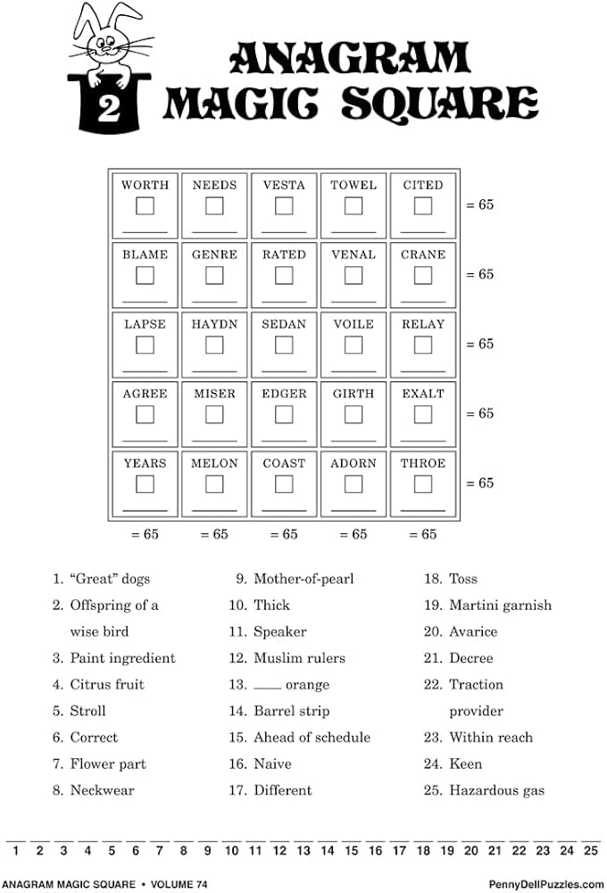

# Anagram Magic Squares

I enjoy the [Penny Press](https://pennypress.com) 
puzzle magazines (those pulp newsprint magazines you see at old folks' homes,
supermarkets, and airports).  I love them when traveling - break out a fountain
pen, and do some crosswords or frameworks or whatevers while my body is moving
cross-country.

One of my all time favorites are the [Anagram Magic Squares](https://www.pennydellpuzzles.com/products/books/anagram-magic-square/):

## What they are

The goal is to fill out the 25-letter quote at the very bottom of the page.

There's a set of clues above the quote.  You figure out what five (or
six) letter word answers the question.  For #2 "Offspring of a wise
bird", the answer is `OWLET`.

Then you find an anagram of that word in the grid - `TOWEL` on the top line.
Fill in that box with a 2.  And write "O" in the second spot of the quote.

The fun happens when you only figure out a subset of answers for the clues. You
need to work back-and-forth from the clues, the quote, and the grid.  Sometimes
you scan the grid and an anagram will jump out at you (`MELON` has `LEMON`, and
question #4 is "Citris Fruit").  And because it is a [magic square](https://en.wikipedia.org/wiki/Magic_square), all the values in the cells in each row and each 
column add up to 65.

Here's the solved puzzle:

## What this is

This/these are anagram magic square generators.  Input a string, 25 characters,
additional punctuation or spaces are ok.  The program will then generate 
the grid and the questions from a pre-made database of anagrams.

The things this does / exercises
  - algorithmic fun in an array generating the magic square
  - stringy stuff for inputting and processing the string
  - correlating the quote with solved anagram words

## Platforms

First platform will be a reference implementation in someting apple-styles.
After that, maybe a PDP-something.

