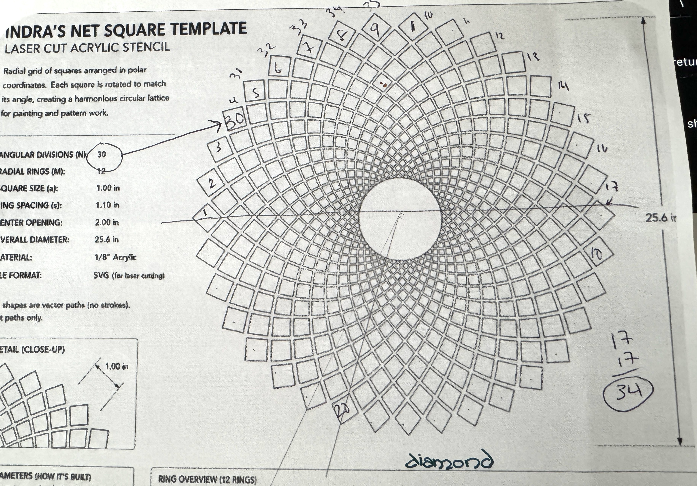

# Indra's Net

I have an incredible artist in the family, and they're wanting to do 
paintings baised on "Indra's Net", which is a significant philosophical
concept (c.f. [Indra's Net on wikipedia](https://en.wikipedia.org/wiki/Indra%27s_net) for more details).  What I'm concentrating on is this shape:

They tried ChantGPT and of course burned many hours (and lord knows how
much of the world's resources) not getting the customzed shapes (like "I
want 34 diamonds around the edge")

Before heading off on vacation, they gave the above sheet, and totally 
[nerdsniped](https://xkcd.com/356/) me.  grr.

## The Plan

First step is a Mac app with sliders and whatnot to control in real time
the parameters of the net.  With CoreGraphics's nice rotation and translation
matrices, should be pretty do-able to create.  That'll let me figure out
(on my own) the math involved.  Then can boil it down for smaller
systems.

I want to make a similar thing for the retro computers, hence why this
is hosted in "More of the Same".  I think the Tektronix 405X style
(what you see in [Cattlecar
Galactica](https://youtu.be/gxnuvbIdC3E?t=27)) would be pretty cool.
Plus we (LSSM) have a vector display on the PDP-11/T55, plus we have a
VT-125 with ReGIS graphics that could be cool.

