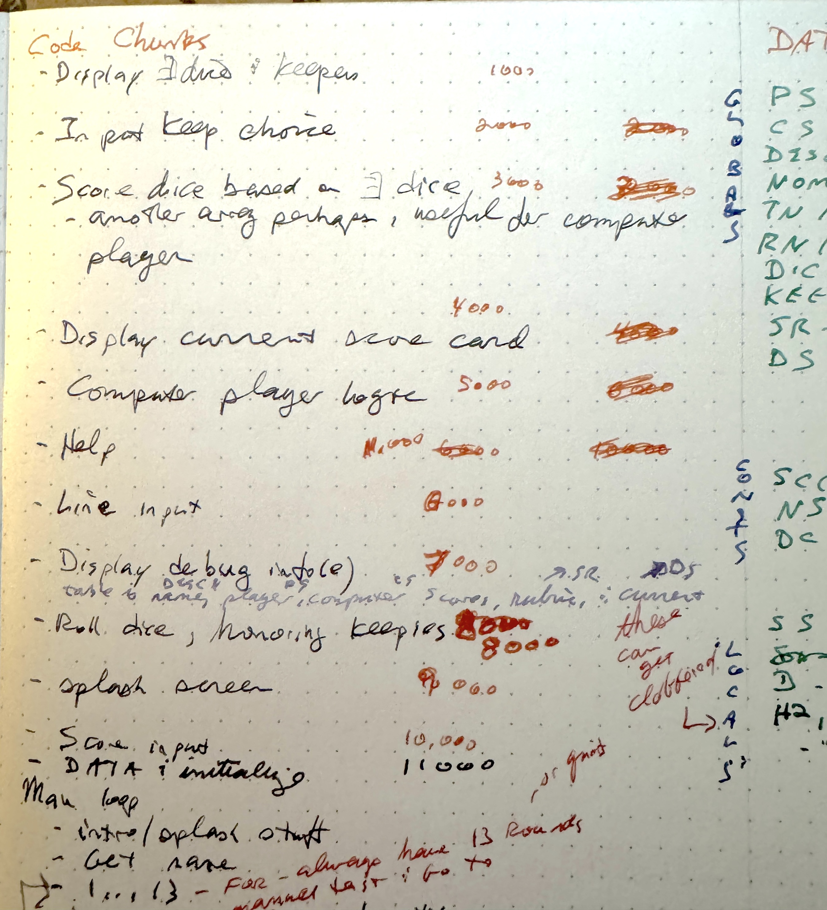

# Dev Notes for Applesoft Yahtzee

There's not a whole lot of documentation in the code.  There's not a
ton of room available, even in a machine with 64K of RAM.  The
`FRE(0)` function says there's a baseline of 36,348 bytes available.
Every comment takes at least 7 bytes - five bytes of per-line
overhead, one byte for the `REM` token, and then one byte for every
character after that.  There's a runtime penalty as well, with the
interpreter executing the line, seeing the `REM` token, and then
moving on to the next line. So the majority of the actual documentation and
interesting stuff is out here in supplemental-documentation land.

## Version impressions

Writing up a short bit of snibbage for the different versions.

*  - bootstrap, organization, data initialization, debug output.  1344 bytes of BASIC
*  - scoring of dice, basic loop to roll randomly and see the scores to sanity-check the work.  2892 bytes of BASIC.  so 1,548 new bytes in this revision.

## Subroutine organization

There are no named procedures or functions in 8-bit-land BASIC
(outside of `DEF FN`, but that's just a one-liner calculation), so
there's no such thing as "passing parameters".  You have lines you can
`GOSUB` to, and data exchange is via globals.  Applesoft doesn't let you
`GOTO` or `GOSUB` using a variable, just a single hardcoded line number. 
That means that symbloic names aren't available.

There's really no tooling to tell you what span of lines belong to what "function",
so you have to keep track of it.  I use paper:

Or machine-readable for the zero of you out there actually interested in the code. 
I broke out the "functions" before writing anything, so space is available for the
work, but hasn't necessarily been done yet.

* `1000` Display dice and keepies
* `2000` Input keep choice
* `3000` _available_ (was going to use that for scoring input, but I put that at line 10000)
* `4000` display current score card
* `5000` computer player logic
* `6000` line input / getting stuff from the user
* `7000` display debug info (added in **y1**)
* `8000` roll dice, honoring keepies
* `9000` splash screen
* `10000` scoring the dice (added in **y2**)
* `11000` data and initialization (added in **y1**)
* `12000` help (originally collided with 11000 in the paper notes. oops!)

So as of this writing in y2, not a whole lot's actually been done, but the core 
scoring logic is in there, which is probably one of the more complex parts.  The
user input parts will probalby be tedious to start out with before building a 
fun text-based UI.

## Data Dictionary

There's also no tooling to tell what variables are in use, what they mean, and how
they're intended to be used.  So we have to do this ourselves.  I'm keeping it on paper,
looking like this:

Don't forget (like I did with `SCHANCE` (Score Chance) colliding with `SCCOUNT` (constant
for count of scores)

Note there is some confusion of zero and one indexing.  Applesoft arrays are zero indexed,
but `DIM(X)` is inclusive to the given index.  So `DIM(13)` gives a 14 element array, 
indexed by values `0...13`.  Most things I'm zero indexing (because it saves an element,
and what I'm used to in C), but some are one-indexed (like the `SS(6)` Scoring Sum 
array used during scoring).  I need to have a Recokinging of them eventually.

* `SCOUNT` - Score Count, how big the scoring array is 
* `PS()` - Player Score, number array `SCOUNT` large, one entry for each scorable line on the scoresheet.  This holds the player's score, with -1 values for unscored rows.
* `CS()` - Computer Score, like player score, but for the computer player
* `DESC$()` - scoring description, string array `SCOUNT` large. Populated by the `DATA` statements on line 11500. These will-be/are in the UI for showing the populated scorecard
* `NOM$` - string, player name
* `TN` / `TC` - turn number (variable) (out of 13) and (total) turn count ("constant")
* `RN` / `RC` - round number (out of 3) and round count
* `DICE()` - the five rolled Dice.  `DIM(4)` number array.  The array is zero indexed, but the contents (the number on the face of each die) is one-based (1-6). **not confusing at all**
* `KEEPIES()` - the dice to keep / no-reroll.  `DIM(4)` number array.  0 to re-roll, 1 to keep.
* `SR()` - scoring rubric. negative numbers aren't really used, but indicate that some dice are meant to be added up. Postive numbers are absolute scores that need to used as-is.  Populated by the `DATA` statements on line 11550-11560
* `DS()` - Dice Score, number array `SCOUNT` large.  The scoring "subroutine" fills this out with the possible scores possible by the dice irrespective of any other rules that require context.
* `NS` - is -1, constant for No Score (not sure if I'm actually using this)
* `DC` - is 4, the dice count, zero indexed

These are used in the scoring subroutine, so will clobber anything else of the same name elsewhere in the program

* `SS()` - Score Sum, number array six (seven) large, one entry for each of the dice faces, **0-indexed**, so it's off by one from the number of pips on the dice
* `SHANCE` - the *Chance* score, sum of all five dice
* `D` - current dice face when walking `DICE`  **1-based**
* `H2` `H3` `HS` `HY` - "Has" flags (zero or one) - has... 2 (of the same face), 3 (of the same face) straight (short or long), or yahtzee.

