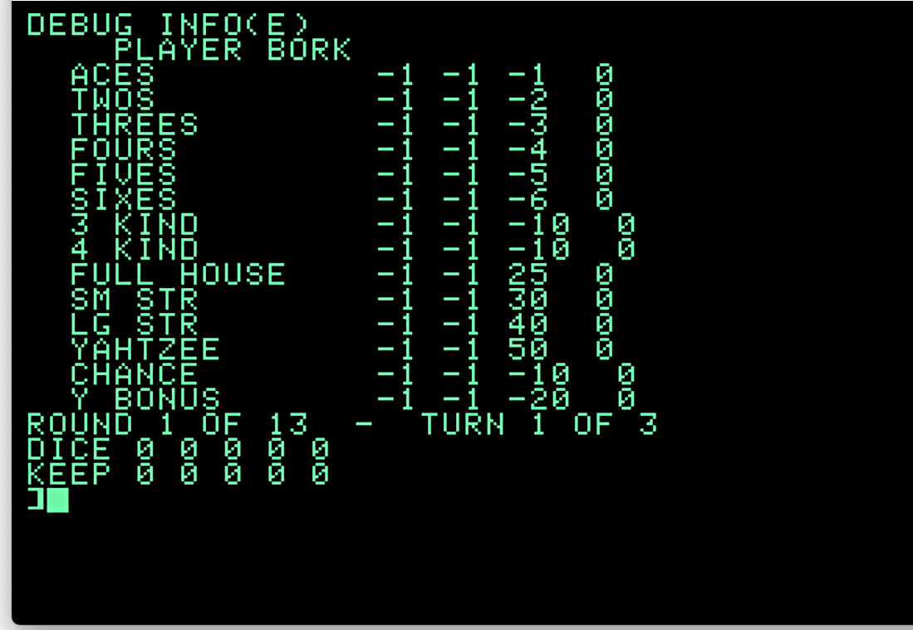
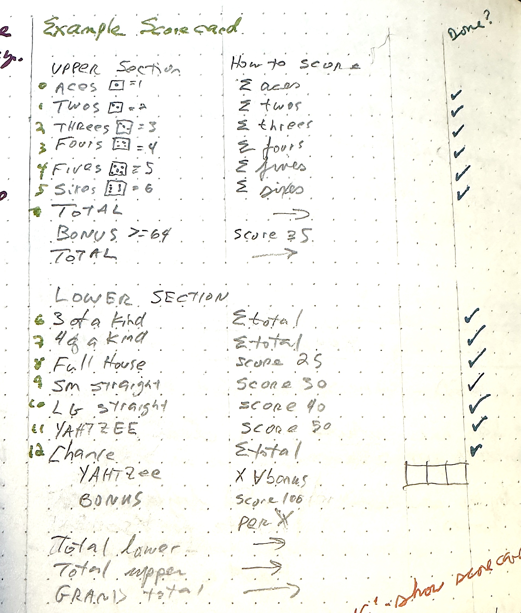

# Y1 - Bootstrap, Organization, Data Initialization, Debug Output

* [code](../version-history/y1.bas)
* [dev-notes](../dev-notes.md) with data dictionary and code organization

1,344 bytes of tokenized BASIC

Screenie:



## Notes

This was the "ok, we've made a battle plan, let's start Doing Stuff".  It lays in
the foundations - making variables early in the symbol table we'll be referring to
(but I'll need to go back and juggle things around as new stuff is added in later
versions).

I knew I wanted arrays to drive a lot of the scoring.  Here's the notes about the
score card:



There's 12 lines, so 13 total elements that the player can record a score in
(along with totals, bonus, extra yhatzen, etc).  

Gotta `DIM` any arrays with more than 11 (0...10) elements:

```
15 SCCOUNT = 13
20  DIM PS(SCCOUNT): REM PLAYER SCORE
21  DIM DESC$(SCCOUNT): REM DESCRIPTION OF ROW SCORE
30  DIM CS(SCCOUNT): REM COMPUTER SCORE
31  DIM SR(SCCOUNT): REM SCORING RUBRIC
```

The 13th element _(if Love is the 5th element, the 13th one is probably
sporks)_ is for the Yahtzee bonus, which doesn't have a number written
in for it on the paper notes, but should be there.

There's arrays for the name of the scoring line (e.g. "Aces", "3 of a
kind"), driven by `DATA` statements, as well as a scoring rubric (add
some dice, add all the dice, or a flat score), also driven by `DATA`:

```
11495  REM  ===== SCORING CARD LABELS
11500  DATA    "ACES", "TWOS", "THREES", "FOURS", "FIVES", "SIXES", "3 KIND", "4 KIND", "FULL HOUSE", "SM STR", "LG STR", "YAHTZEE", "CHANCE", "Y BONUS" 
11549  REM  ===== SCORING RUBRIC
11550  DATA  -1,-2,-3,-4,-5,-6 : REM  UPPER
11560  DATA  -10, -10, 25, 30, 40, 50, -10, -20
```

I needed to load that stuff from the data statements on program launch.  First the
descriptions (because that data is first, and `DATA` reads in the order of the
data statements in the program)

```
10999  REM  DATA AND INITIALIZATION 
11000  FOR I = 0 TO SCCOUNT
11010  READ DESC$(I)
11020  NEXT 
```

and also the Scoring Rubric - `SR`:

```
11050  FOR I = 0 TO SCCOUNT
11060  READ SR(I)
11070  NEXT 
```

There's also some more arrays:

```
38  DIM DICE(4): REM DICE
39  DIM KEEPIES(4): REM DICE TO KEEP FOR NEXT TURN 
40 NS =  - 1: REM CONSTANT FOR 'NO SCORE'
41  DIM DS(SCCOUNT): REM SCORES FOR CURRENT DICE FACES
```

Where `DICE` is the faces (1...6) of the rolled dice, `KEEPIES` is the set of dice
to keep when re-rolling happens, and `DS` is for taking a set of 5 dice faces and
computing scores (that work happened in [y2](y2.md))

### Debug Output

I figured having something I can look at that has :all-the-things: would be useful,
so the program, after initialzation, falls through to the debug output at line 7000. 
Here's the screenie again:


The columns are:

* name/Description of the scoring line (from `DESC$()`)
* Player Score (from `PS()`), which has -1 for empty/unscored slots. Can't use zero because zero is a legit score that could be noted during play
* Computer Score (from `CS()`), which behaves the same as Player Score
* Scoring Rubric (from `SR()`), described above
* the computed Dice Score (from `DS()`), the score of the rolled dice, explained in the [dev-notes](../dev-notes.md)
