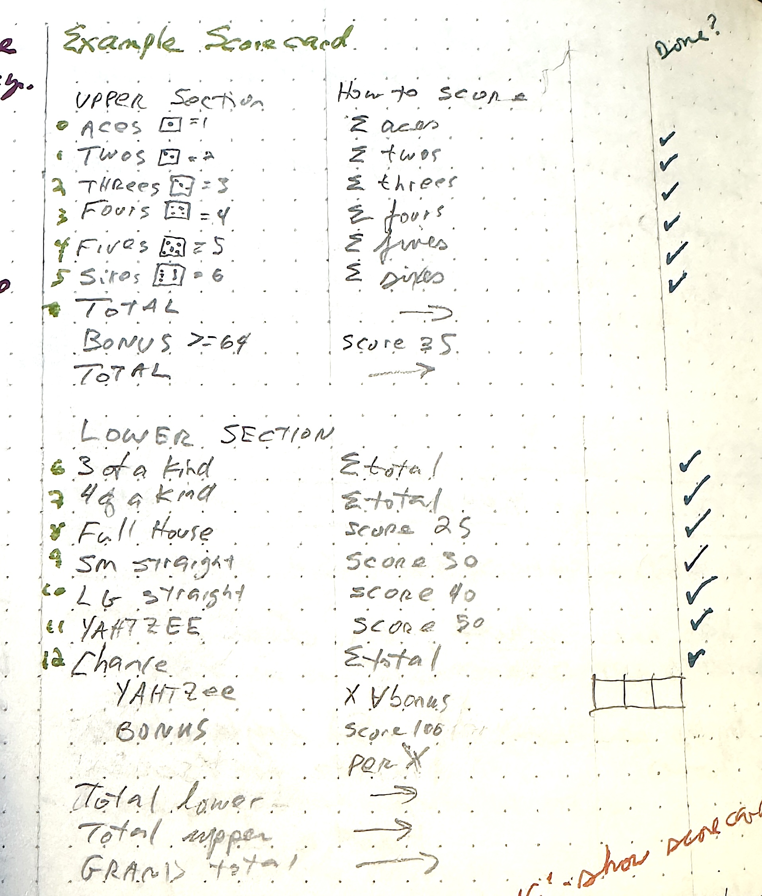

# Y2 - Scoring the dice

* [code](../version-history/y2.bas)
* [dev-notes](../dev-notes.md) with data dictionary and code organization

2,892 bytes of tokenized BASIC

Screenie:


Movie:


## Notes

This is the "actually do something interesting" version.  Put some numbers into 
the `DICE()` array, and then fill out the `DS()` (dice score) array with the scores
of the dice, without any consideration outside of just the dice.

This is the scorecard logic, along with the checkmarks made as different parts of
the algorithm were written:



first off, zero out stuff:

```basic
10000  FOR I = 0 TO 5:SS(I) = 0: NEXT 
10010  FOR I = 0 TO SCCOUNT:DS(I) = 0: NEXT 
10020  SHANCE = 0
```

`SS()` is the Score Sum.  It's the *count* of the number of faces seen
on the dice.  If the player rolled `1,2,4,2,2`, then the SS array
(zero index) would be `[1,3,0,1,0,0]`. That is, one one, three twos,
no threes, one four, no fives or sixes.  `SHANCE` is `SCHANCE` (score
chance) but without stepping on `SCCOUNT`.  Remember that Applesoft
only uses the first two characters of a variable name.

Walking the dice and count up the faces is pretty straightforward, accounting for the
zero-base. _I really should just make it one-base_.  Code indentation has been
adjusted for online ease of reading.

```basic
10110  FOR I = 0 TO DC
10120     D = DICE(I)                 extract the face showing
10130     SS(D - 1) = SS(D - 1) + 1   increment corresponding element of `SS()`
10140     SHANCE = SHANCE + D         Chance is always the sum of the faces
10150  NEXT : REM DICE 0...4
```

Now to actually calculate the scores and start filling in `DS()` (dice score). Start
with the top section, and Chance. Bascially, multiply the count of number of dice 
seen for a face value, by the face value

```basic
10700  FOR I = 0 TO 5:DS(I) = SS(I) * (I + 1): NEXT 
10710  DS(12) = SHANCE
```

That's seven done right there.  yay!

Next is 3 and 4 of a kind, which are scored by summing the dice, which happily
has already been done and stored in `SHANCE`.  To figure this out, walk the
six dice faces, and if any of them are 3 (or over), it counts as a three of a kind.
If any of them are 4 (or over), it counts as four of a kind.

```basic
10720  REM ---SCORE 3 AND 4 OF A KIND
10750  FOR I = 0 TO 5
10760  IF SS(I) >  = 3 THEN DS(6) = SHANCE: REM 3 OF A KIND
10770  IF SS(I) >  = 4 THEN DS(7) = SHANCE: REM 4 OF A KIND
10775  NEXT 
```

Full-house is the next one.  If there's 2 of a dice face and 3 of another dice face,
then that's a full house.  Walk the `SS()` array, and set a couple of flags.
Set `H2` (has two) if a pair are seen and `H3` (has three) if three are seen.
So a roll of 1,2,3,2,2 would set `H3`. `H2` would stay clear.

The rules are kind of ambiguous about whether a Yahtzee (all five the same) count as
a full house. I think so: a roll of 1,1,1,1,1 has a pair of ones, and also a triple
of ones. That they happen to match is irrelevant.

```basic
10778  REM ----FULL HOUSE: 2 OF ONE AND 3 OF ANOTHER
10780  H2 = 0: H3 = 0: REM HAS 2 OR HAS 3 'BOOLS'
10790  FOR I = 0 TO 5
10800      IF SS(I) = 2 THEN H2 = 1
10810      IF SS(I) = 3 THEN H3 = 1
10814      REM BE PEDANTIC AND ACCEPT 5 OF A KIND AS A FULL HOUSE TOO
10815      IF SS(I) = 5 THEN H2 = 1:H3 = 1
10820  NEXT I
```

If both H2 and H3 are set, we must have a full house:

```basic
10830  IF H2 AND H3 THEN DS(8) = SR(8)
```

The straights are the next.  Things like 2,3,4,5 or 1,2,3,4,5. I tried to
be clever (see if there are contiguous ranges of numbers 4 or 5 long), or see
if there's a string of five 1's but a single zero at either end.  My brain
couldn't be clever, so I just brute forced it.  The Large Straight is easier to see
what's happening.  `HS` is a flag for "Has Straight"

```basic
10920  HS = 0: REM  RESET AND LOOK FOR LORGE STRAIGHT
10930  IF SS(0) AND SS(1) AND SS(2) AND SS(3) AND SS(4) THEN HS = 1
10935  IF  NOT HS AND SS(1) AND SS(2) AND SS(3) AND SS(4) AND SS(5) THEN HS = 1
```

In plain language, if there is a non-zero face count for 1,2,3,4,5 then set HS,
or if there is a non-zero face count for 2,3,4,5,6, then set HS.

Line 10935 has `NOT HS AND ...` - that is essentially doing an ELSE, which Applesoft
does not have - it skips the rest of the line if we've already set the flag.  Now that
I'm looking at this with fresh(ish) eyes, I think I can drop that check and not
lose correctness.

*BUT* for performance reasons, if I short-circuit "hey I we know there's a straight here,
don't need to access five more variables and do five more logical operations", that would 
be a savings of time.  Accidental performance increase if the large straight was found
first. (no savings if it was found last).  

Scoring happens by pulling the constant score out of the Scoring Rubric `SR()`:

```basic
10940  IF HS THEN DS(10) = SR(10)
```


The same logic and scoring applies to the Smol Straight, also exhaustively
enumerating the possibilities (1,2,3,4; 2,3,4,5; 3,4,5,6).  Note `SS()` is zero
indexed here, so SS(1) is actually the number of twos seen.

```basic
10840 HS = 0: REM  HAS(SMOL) STRAIGHT
10850  IF SS(0) AND SS(1) AND SS(2) AND SS(3) THEN HS = 1
10855  IF  NOT HS AND SS(1) AND SS(2) AND SS(3) AND SS(4) THEN HS = 1
10900  IF  NOT HS AND SS(2) AND SS(3) AND SS(4) AND SS(5) THEN HS = 1
10910  IF HS THEN DS(9) = SR(9)
```

Finally, look for a yahtzee - see of there's any seen-faces that add up to five.
If so, pull the score from the Rubric

```
10950 HY = 0: REM  HAS YAHTZEE
10960  FOR I = 0 TO 5
10965  IF SS(I) = 5 THEN HY = 1
10970  NEXT 
10980  IF HY THEN DS(11) = SR(11)
```

### Readability vs performance

You may have noticed I have a couple of `FOR I = 0 to 5` (five in fact) loops that
set flags based on what it's seen. I could bundle all these into a single loop, and 
have the same logic  (set HS, and HY, and H2 and H3).  I find it easier to read and
think about of "I have a scoring line with this logic, let me be able to focus in
on that without having to wade through uninteresting stuff".  There is a performance
penalty, having to perform the overhead associated with each loop (get some memory
to store the loop machinery, push some stuff on the stack, initialize and assign the
induction/index variable over and over again).

The scoring takes less than a second
or so. I'm fine with that. If the scoring speed ends up making things annoying, I can
optimize this.

You can see in the movie above that dice are re-rolled, they're
scored, and the debug display updated in a second or two.  Good enough for me `:-)`

