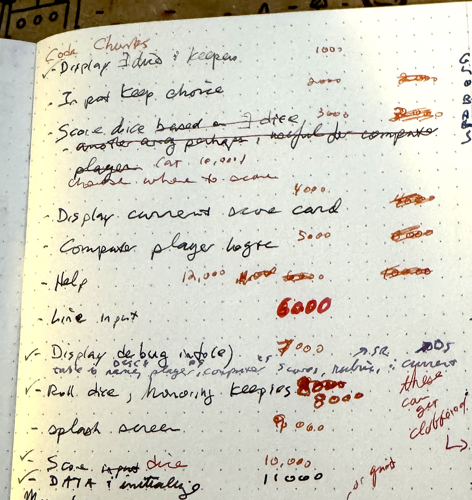
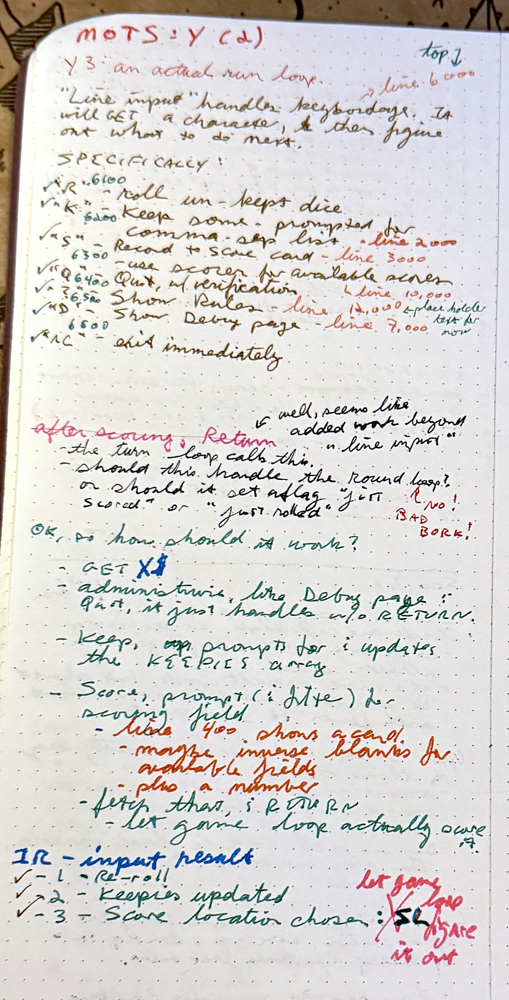
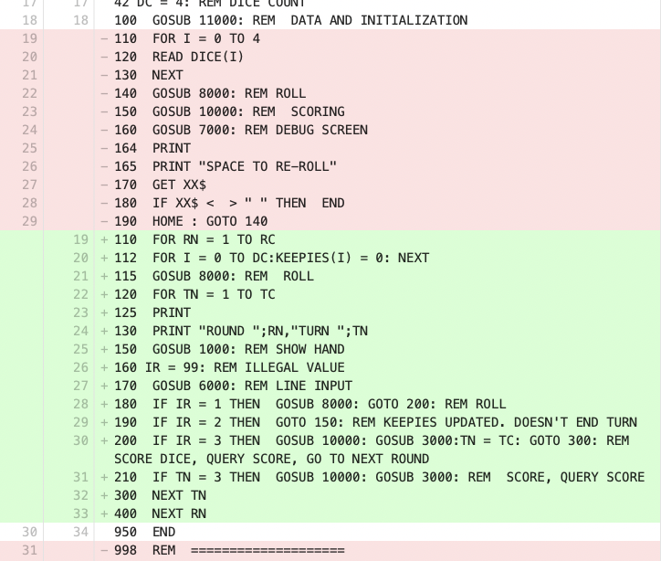

# Y3 - Command-Line Game Look

* [code](../version-history/y3.bas)
* [dev-notes](../dev-notes.md) with data dictionary and code organization

4,261 bytes of tokenized BASIC

Screenie:


Movie:


## Notes

The _Code Chunks_ list where the various subroutines would exist came in to its
own writing Y3.  A number of places fleshing out the code, I knew exactly what to
call to do work.  Figuring out communication from one subroutine to another took
a fair amount of thought.

Here's the updated chunks list:



And the new page:



### Hard-learned lesson

Had a hard-learned lesson:


Bascially, I was trying to do a `continue` by calling `NEXT`, in essence having
multiple NEXTs in the loop when re-rolling (or not) kept dice:


What happened is if the `continue` NEXT is hit, and then the last NEXT is hit,
the loop variable can go to the terminal value + 1, causing an array overflow.
(thanks to explicitly `DIM`ing the dice array smaller than the default of 11
elements, which would not have caught this issue had I left the array the
default size)

I was staring and staring at the code "how can line 8030 be accessing an out of
bounds index?", hitting a value of 5 (instead of `DC`, dice count, which is 4)

### Responsibilities and Communications

"Communication" from one part of a BASIC program to another is kind of a
weird idea, since there are no functions (in the usual modern langauge sense
of _functions_) or return values.  It's all a cooperation of what variables
are set and what those mean.

In this case, the line-input subroutine (at line 6000) - get the user input, and
do things like update the kept dice, re-roll (if possible), show game help,
show the debug panel, or exit the game early.

Originally was thinking the line input would handle the logic for the turn (1, 2, or 
3 rolls), and then it would fill out the dice array and get things set up for
scoring, but that seemed like it was putting a lot of responsibility into
a "line input" routine.  

So ultimately, it's pretty simple - doing a `GET` to fetch
a single character.  Things that are kind of administrivia (show the debug panel,
update keepies, show the help) are done without exiting.  

if the user chose to re-roll, set `IR` (Input Result), to actually re-roll in the
gameloop 110-400. (specifically line 180)

```basic
170  GOSUB 6000: REM LINE INPUT
180  IF IR = 1 THEN  GOSUB 8000: GOTO 200: REM ROLL
```

And oops, that `goto 200` should be `goto 300` - end the turn.  Right now the 
fallthrough logic still works ok.  **FIX THIS FOR Y4**

If the user chose to update the keepies, they're asked to enter a string of
digits to keep:

```
6205  FOR I = 0 TO DC:KEEPIES(I) = 0: NEXT   // clear out the keepies
6210  INPUT "KEEP WHICH ONES (e.g.134) ";X$  // will be a string of ascii digits
6220  FOR I = 1 TO  LEN(X$)
6230     K$ =  MID$ (X$,I,1)
6240     K = ASC(K$) -  ASC("0")             // convert ascii digit to integer value. "3" -> 3
6250     KEEPIES(K) = 1
6260  NEXT 
```

And then once the keepies are updated, `IR` is set to 2.  The runloop then jumps up
to "show the current hand highlighting kept dice"

```basic
190  IF IR = 2 THEN  GOTO 150: REM KEEPIES UPDATED. DOESN'T END TURN
```

And then if the user chooses to score, `IR` is set to 3, and then the runloop
is responsible for calling the scoring (line 10000), and then querying for the
score row to populate:

```basic
// This is a "break" to get out of the round loop
200  IF IR = 3 THEN  GOSUB 10000: GOSUB 3000: TN = TC: GOTO 300: REM SCORE DICE, QUERY SCORE, GO TO NEXT ROUND
// and also look to see if we need to go straight to the score handling because
// we've run out of the turn.
210  IF TN = 3 THEN  GOSUB 10000: GOSUB 3000: REM  SCORE, QUERY SCORE
```

### Main Loop Changes

The diff is kind of nice for changing out the old debug loop vs the actual mostly-working
game loop:




