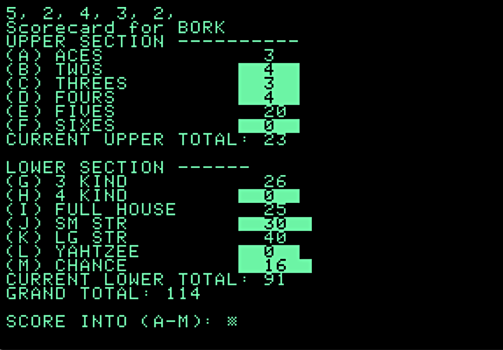

# Y3 - Command-Line Game Look

* [code](../version-history/y4.bas)
* [dev-notes](../dev-notes.md) with data dictionary and code organization

5,955 bytes of tokenized BASIC, 22 disk sectors.

Screenie:

Movie:

## Notes

This was primarily a layout and UI version - displaying the current score card
and letting the user pick which one to save a score.

Not 100% happy about the code, but I need to let it bake.  There's some duplicated
logic that probably could be consolidated.  The lack of an `ELSE` makes things kind
of annoying to do.  There may be a better way to structure such things.

Right now I'm doing  "label each row with a letter" thing.  Makes it easy to go from
a letter to an index (subtact an ASCII `"A"`, which is 65).  Then a `GET` to get
a letter.  After converting to an index, is out of range, beep and go back to the
`GET`.  Also takes a look at the scoring array.  Negative one is used as a flag
for "this row hasn't been scored yet" vs a "this row has a score of zero".  If the
user tries to score into an already scored row, it'll beep too.

I'm using `INVERSE` mode to show the rows that haven't been scored yet (and so
are eligible to be chosen)

I'd like for more interactive UI - use arrow keys and space bar to choose stuff
rather than "look for a letter then type it".  Also want a similar kind of UI
for keeping dice rather than inputting a zero to 4.  Very Programmery

