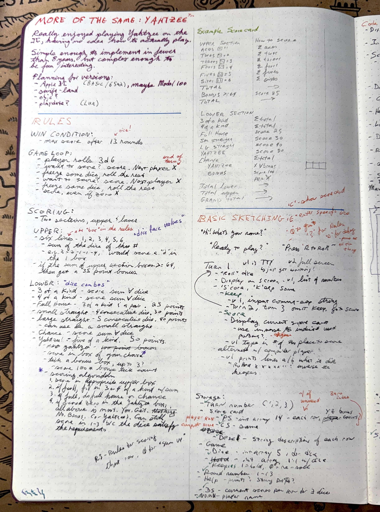
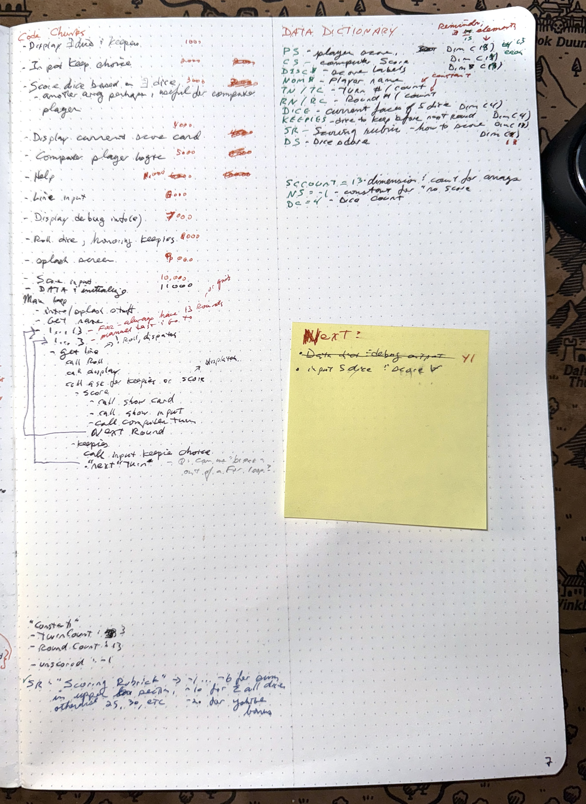
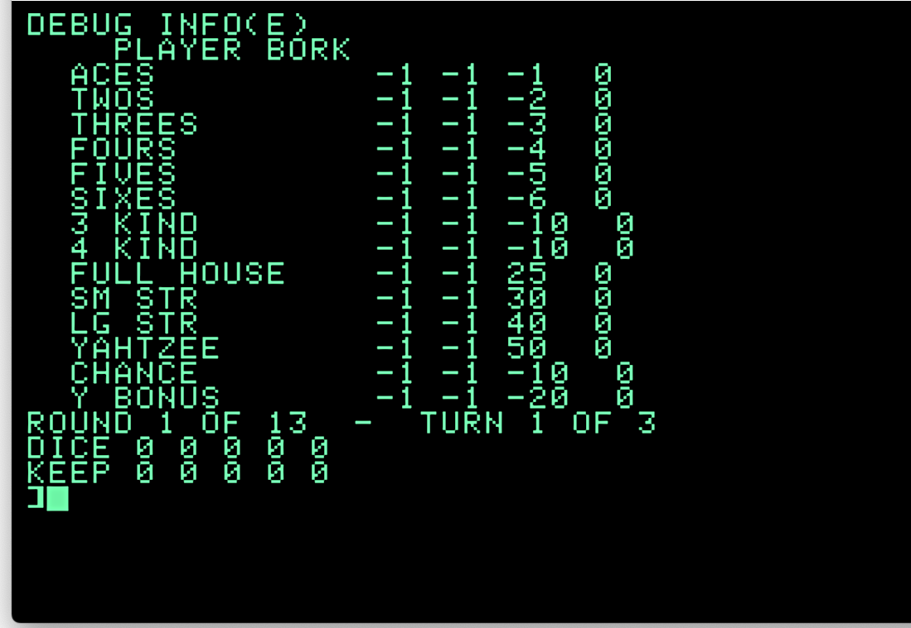
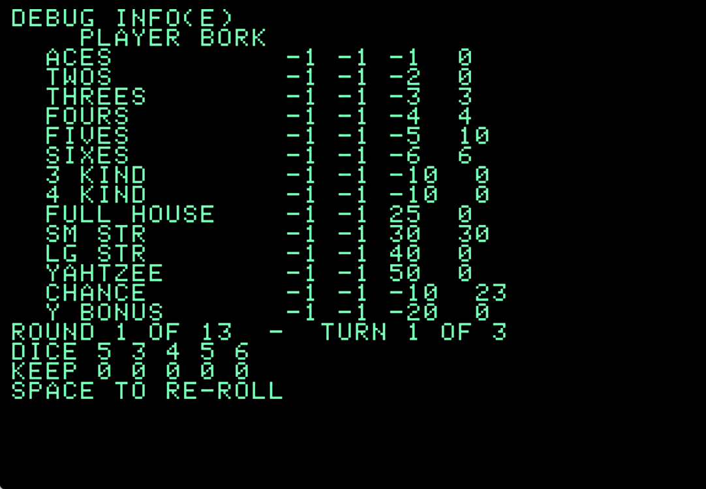

# Apple 2 Yahtzee

First version of the first project in this repo.  yay me.

Using **Apple Commander** (https://applecommander.github.io) for accessing the goodies off of the committed disk image.

Extract the Applesoft program with something like:

```
% ~/bin/ac-mac-aarch64-13.0 -e Yahtzee.DO PROGRAM_NAME > blah.bas.txt
```

To see the latest (extracted) code, [check it out](yahtzee.bas)

Program development on an actual Apple 2 with a BMOW [Floopy Emu](https://shop.bigmessowires.com/products/floppy-emu-model-c) instead of physical disks.

Program playback screenshots and animations via [Virtual //](https://www.virtualii.com)

## Notes

I'm trying to keep To The Era, using tools that were available back then. So no lappy for taking notes in markdown and using pandoc to blah blah blah.  The computer had the BASIC program, and if you had any additional stuff to keep track of, you used pen, pencil, and paper.

So here's design notes (I **am** a fountain pen nerd).  I may transcribe some of them for easier consumption.  

| page 1 | page 2 |
| ----- | ----- |
|  |  |


## It works!

### Y1 - Getting the basics (heh) going

The first version, "Y1", has the data structures defined and initialized, ready for further logic and gameplay.  Also a debug output screen to show all the moving pieces:




### Y2 - It shoots, it scores!

Y2 takes the five dice, and calculates all the scores possible with those dice.
Other parts of the program will be using that to figure out what to do next.

This version has a loop that rolls dice, calculates the score, then shows the debug
screen.  Press space to re-roll and re-score, or anything else to quit.



The columns are description, player score, computer score (both just -1s for now), the scoring rubric (negative numbers are adding up dice, positive numbers are absolute scores that shold be used), and then the calculated scores.

In this example, the user rolled a 5, 3, 4, 5, 6.  With that, they can do:

* sum of 3's - gives 3
* sum of 4's - gives 4
* sum of 5's - gives 10
* sum of 6's - gives 6
* a small straight scores 30
* chance (sum of all dice) scores 23
* all other scores are zero

There's also a video:  

### Y3 - Game Loopy

Y3 lets you play the game without the computer player or recording a score.
Other things work - such as displaying the hand, keeping dice, re-rolling other
dice, calling a scoring routine to calculate the scores, and a place holder to
actually add them to the player's score sheet.

It takes out the "roll and display scores" loop from the Y2 and replace it with
the start of the Real Game Loop.

It's all purely TTY/command-line right now (no addressible text used), mainly
for simplicity - get the game working like that, then I can add stuff like
drawing dice, and making a fancy scorecard.

The input routine was the main thing I needed to give a think through. There's a number
of commands you can do:

* "R" - Roll (moves to next turn)
* "K" - update keeps (does not affect current turn/round)
* "S" - Score (and end round)
* "Q" - Quit with verification
* "^C" - just quit
* "?" - display rules (placeholder)
* "D" - Display the debug screen

Here's a screenie: 

and a video:  showing things.

